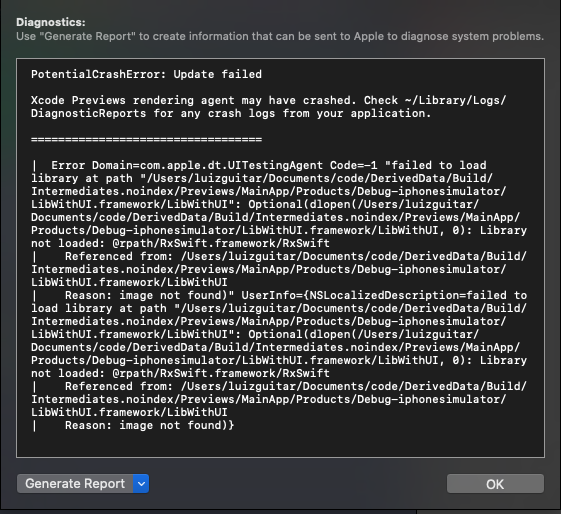

# SwiftUI + CocoaPods + iOS framework crash

When trying to add a CocoaPods dependency in an iOS framework that has SwiftUI views, the Preview will crash.

Even in an empty project where the dependency is not even used. And that happens for any CocoaPods dependency.

